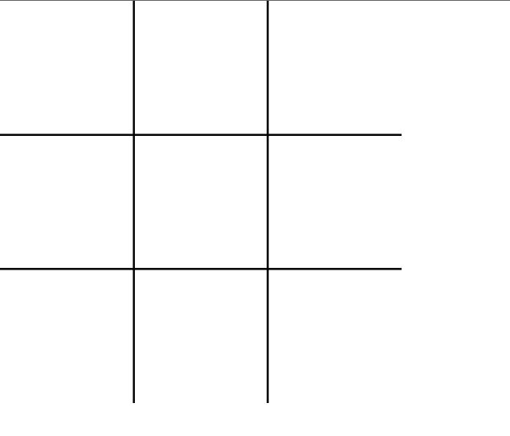
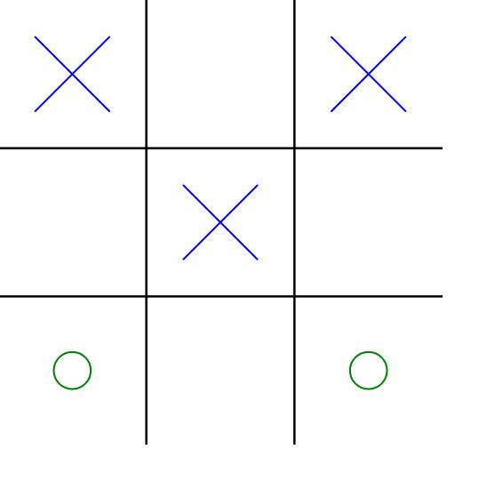
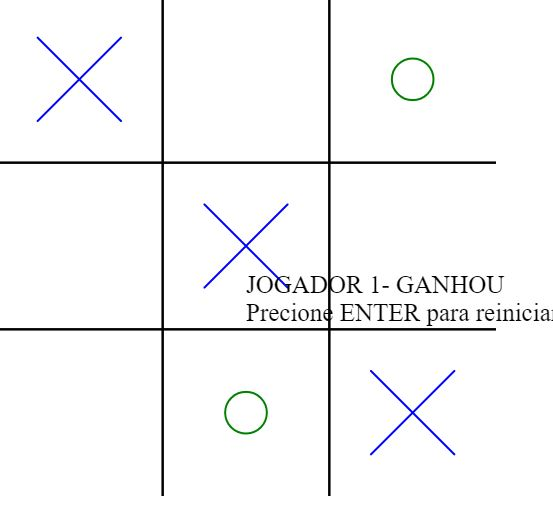
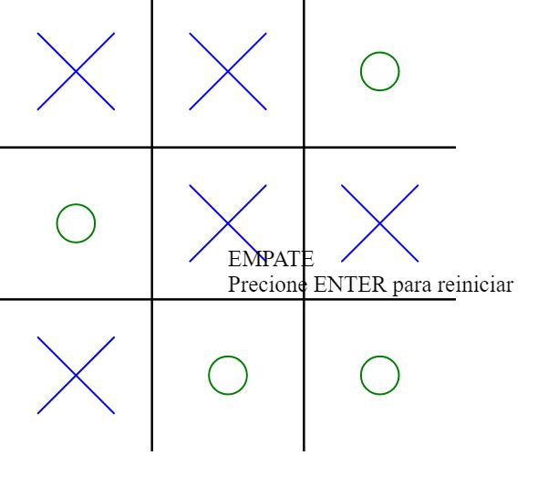

# Jogo da Velha - Player vs. Player

## Descrição

Este é um simples jogo da velha Player vs. Player (PvP) desenvolvido em JavaScript usando a biblioteca p5.js para a parte gráfica. O jogo permite que dois jogadores joguem alternadamente, preenchendo os espaços vazios do tabuleiro com seus respectivos símbolos (X ou O). O jogador que conseguir alinhar três símbolos iguais vertical, horizontal ou diagonalmente será o vencedor. Se todas as casas forem preenchidas sem que haja um vencedor, o jogo terminará em empate.

## Comandos do Teclado

- Pressione a tecla "ENTER" para reiniciar o jogo após uma partida ser concluída.

## Tecnologias Utilizadas

- HTML5
- CSS3
- JavaScript (ES6)
- [p5.js](https://p5js.org/) (para a parte gráfica)

## Capturas de Tela

